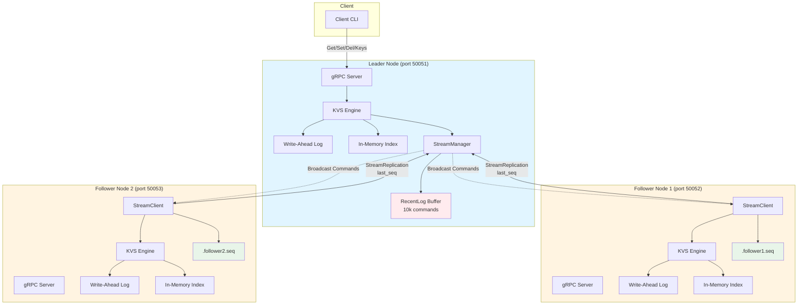
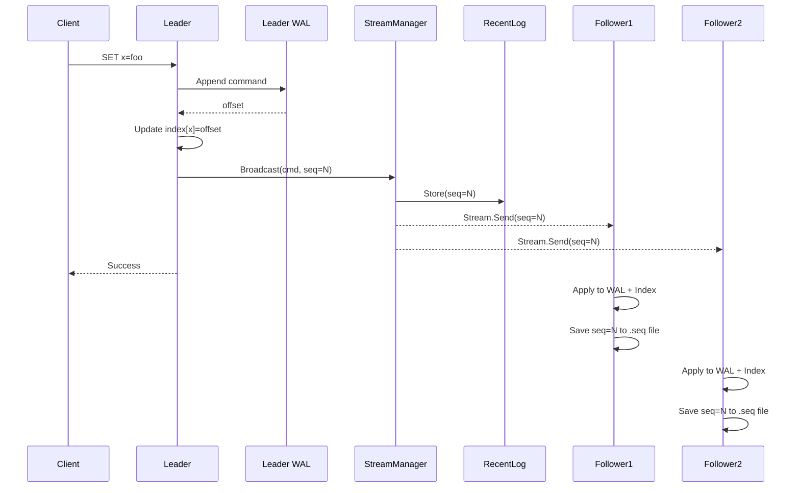
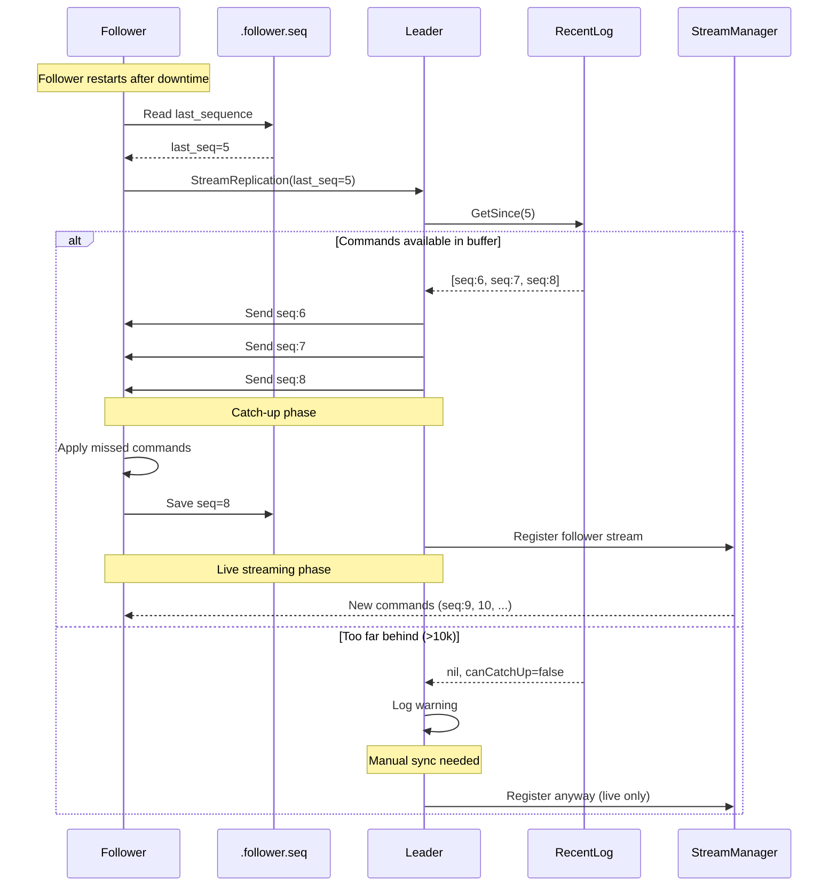
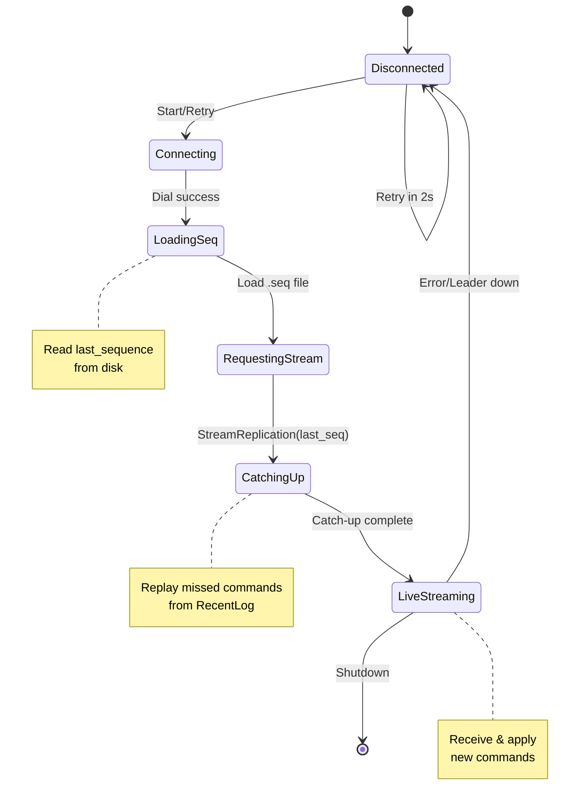
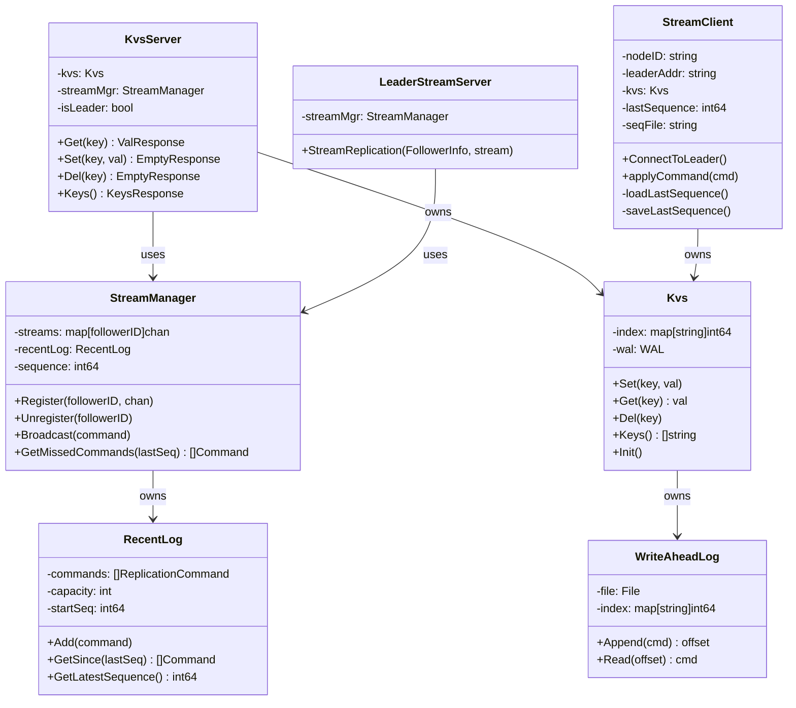
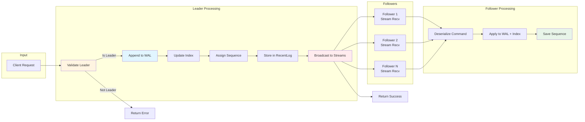

# go-kvs

Distributed key-value storage with leader-follower streaming replication.

## Features

- **Write-Ahead Log (WAL)**: All commands persisted to disk for durability
- **In-memory Index**: O(1) lookups with WAL offset values
- **Streaming Replication**: Real-time command streaming to followers via gRPC
- **Automatic Catch-Up**: Followers replay missed commands on reconnect (up to 10,000)
- **Sequence Tracking**: Persistent sequence numbers prevent data loss on restart
- **Auto-Reconnect**: Followers automatically retry connection on failure
- **No Startup Order Dependency**: Start nodes in any order
- **Dynamic Follower Registration**: Followers connect themselves to leader
- **Low Latency**: Immediate replication on write (no polling)

## Architecture

### System Overview



### Write Operation Flow



### Catch-Up Mechanism Flow



### Follower Connection States



## How It Works

### Storage Layer
- **Write-Ahead Log (WAL)**: Append-only log file storing serialized commands
- **In-memory Index**: Map of `key → WAL offset` for fast lookups
- **Crash Recovery**: On startup, replay WAL to rebuild in-memory index

### Replication Flow
1. **Follower connects**: Calls `StreamReplication(last_sequence)` RPC to leader
2. **Leader catch-up**: Replays missed commands from RecentLog buffer (if any)
3. **Leader registers**: Adds follower to active streams map
4. **Client writes**: Leader applies to local WAL + index, stores in RecentLog
5. **Broadcast**: Leader sends command to all follower streams (with sequence number)
6. **Follower applies**: Deserializes, applies to local WAL + index, persists sequence

### Catch-Up Mechanism
When a follower reconnects after being offline:
1. **Load last sequence**: Read from `.{nodeID}.seq` file (e.g., `.follower1.seq`)
2. **Request catch-up**: Send `last_sequence` to leader
3. **Leader replays**: Leader checks RecentLog buffer for missed commands
4. **Apply missed**: Follower receives and applies all missed commands in order
5. **Resume live**: Continue with live stream after catching up

**Buffer limit**: Leader keeps last 10,000 commands in memory. If follower missed more, manual sync needed.

### Operations
- **SET**: Append to WAL → Update index → Broadcast to followers
- **GET**: Lookup key in index → Read from WAL at offset → Deserialize
- **DEL**: Mark as deleted in index → Broadcast to followers
- **KEYS**: Return all keys from in-memory index

## Quick Start

### Build
```bash
go build ./cmd/server/
go build ./cmd/client/
```

### Single Node Mode

**Terminal 1 - Server:**
```bash
./server --leader --port=50051
```

**Terminal 2 - Client:**
```bash
./client
> set name alice
> get name
alice
> keys
Keys (1):
  - name
> exit
```

### Replicated Mode (3 nodes)

**Start in any order - followers will auto-connect:**

**Terminal 1 - Leader:**
```bash
./server --node-id=leader --leader --port=50051
```

**Terminal 2 - Follower 1:**
```bash
./server --node-id=follower1 --port=50052 --leader-addr="localhost:50051"
# Output: Connected to leader, receiving stream
```

**Terminal 3 - Follower 2:**
```bash
./server --node-id=follower2 --port=50053 --leader-addr="localhost:50051"
# Output: Connected to leader, receiving stream
```

**Terminal 4 - Client:**
```bash
./client
> set x foo
> set y bar
> set z baz
> keys
Keys (3):
  - x
  - y
  - z
```

**Verify replication:**
```bash
# Check follower WAL files
cat wal-follower1.log  # Should contain x, y, z
cat wal-follower2.log  # Should contain x, y, z
cat wal-leader.log     # Should contain x, y, z

# Check sequence tracking
cat .follower1.seq     # Contains last sequence number (e.g., "3")
cat .follower2.seq     # Contains last sequence number
```

### Testing Catch-Up (Follower Offline Scenario)

**Simulate follower downtime and automatic catch-up:**

```bash
# Start leader and follower1
./server --node-id=leader --leader --port=50051
./server --node-id=follower1 --port=50052 --leader-addr="localhost:50051"

# Do some writes
./client
> set a 1
> set b 2
> set c 3

# Start follower2 LATE (misses a, b, c)
./server --node-id=follower2 --port=50053 --leader-addr="localhost:50051"

# Leader logs show:
# "Follower follower2 connected (last_seq=0)"
# "Replaying 3 missed commands to follower2"
# "Follower follower2 caught up successfully"

# Verify follower2 has all data
cat wal-follower2.log  # Should contain a, b, c
cat .follower2.seq     # Should show "3"

# More writes (all followers get these)
> set d 4
> set e 5

# Stop follower2 (Ctrl+C), do more writes
> set f 6
> set g 7

# Restart follower2 - automatic catch-up!
./server --node-id=follower2 --port=50053 --leader-addr="localhost:50051"

# Logs show:
# "Loaded last sequence: 5"
# "Connecting to leader (last_seq=5)"
# "Replaying 2 missed commands to follower2"  ← Only f and g!

# All followers now have a through g
```

## Client Commands

| Command | Description | Example |
|---------|-------------|---------|
| `get {key}` | Retrieve value for key | `get username` |
| `set {key} {val}` | Store key-value pair | `set username alice` |
| `del {key}` | Delete key | `del username` |
| `keys` | List all stored keys | `keys` |
| `exit` | Close client | `exit` |

## Server Command-Line Flags

| Flag | Description | Required | Example |
|------|-------------|----------|---------|
| `--node-id` | Unique node identifier | No (default: node1) | `--node-id=leader` |
| `--leader` | Run as leader | No (default: false) | `--leader` |
| `--port` | Port to listen on | No (default: 50051) | `--port=50052` |
| `--leader-addr` | Leader address (follower only) | Yes for followers | `--leader-addr=localhost:50051` |

## Streaming Replication Details

### Connection Flow
1. **Follower → Leader**: Follower initiates gRPC `StreamReplication()` call
2. **Leader**: Creates buffered channel (100 commands) for follower
3. **Leader**: Registers channel in StreamManager
4. **Leader**: Goroutine sends commands from channel to gRPC stream
5. **Follower**: Loop receives commands via `stream.Recv()`
6. **Follower**: Applies each command to local KVS

### Failure Handling
- **Follower disconnects**: Leader detects, removes from active streams, saves last sequence
- **Follower reconnects**: Automatically catches up from RecentLog buffer (up to 10k commands)
- **Leader restarts**: Followers retry connection every 2 seconds, rebuild RecentLog from new writes
- **Network partition**: Followers log errors, keep retrying, catch up when reconnected
- **Stream buffer full**: Command dropped with warning (configurable to block)
- **Too far behind**: If >10,000 commands missed, warning logged (manual sync needed)

### Why This Design?

**Advantages over leader-initiated connections:**
- ✅ No startup order dependency
- ✅ Followers can join/leave dynamically
- ✅ Leader doesn't need to know follower addresses
- ✅ NAT/firewall friendly (outbound only from follower)
- ✅ Auto-reconnect built-in

**Trade-offs:**
- **Limited catch-up**: Only keeps last 10,000 commands (configurable)
- **Memory overhead**: Leader keeps RecentLog + one channel + goroutine per follower
- **Sequence files**: Additional `.{nodeID}.seq` files for tracking (small overhead)

## Component Architecture

### Class/Component Diagram



### Data Flow Diagram



## Project Structure

```
go-kvs/
├── api/proto/              # Protocol Buffer definitions
│   ├── kvs.proto          # Client-server RPC
│   └── replication.proto  # Leader-follower streaming
├── cmd/
│   ├── client/            # Client CLI application
│   └── server/            # Server application
├── internal/
│   ├── client/            # Client gRPC wrapper
│   ├── config/            # Server configuration
│   ├── follower/          # Follower stream client
│   │   └── stream_client.go  # Connects to leader, handles catch-up, sequence persistence
│   ├── replication/       # Replication components for leader
│   │   ├── stream_manager.go  # Manages active follower streams
│   │   └── recent_log.go      # In-memory buffer for catch-up (10k commands)
│   └── server/            # gRPC server handlers
│       ├── server.go      # Client-facing handlers (Get/Set/Del/Keys)
│       ├── leader_stream.go  # Follower stream handler with catch-up logic
│       └── middleware/    # Logging interceptor
└── pkg/kvs/               # Core KVS logic (WAL + Index)
    ├── kvs.go             # Main KVS implementation
    ├── command/           # Command serialization
    └── wal/               # Write-Ahead Log
```

## Troubleshooting

### Follower can't connect to leader
```
Error: Failed to dial leader, retrying in 2s...
```
**Solution**: Ensure leader is running and address is correct.

### Write fails with "not leader"
```
Error: not leader
```
**Solution**: Client must connect to leader (port 50051), not follower.

### Keys missing on follower
```
cat wal-follower1.log  # Missing some keys
```
**Possible causes**:
1. **Too far behind**: Follower missed >10,000 commands
   ```
   Leader logs: "Follower too far behind, needs manual sync"
   ```
   **Fix**: Copy leader's WAL manually or wait for snapshot feature

2. **Sequence file corrupted**:
   ```bash
   cat .follower1.seq  # Shows wrong number
   ```
   **Fix**: Delete `.follower1.seq` and restart (will catch up from sequence 0)

3. **Leader restarted**: RecentLog buffer lost (in-memory only)
   **Fix**: Leader should rebuild buffer from new writes, old history lost

### Build errors
```
protoc: command not found
```
**Solution**: Install Protocol Buffers compiler:
```bash
# macOS
brew install protobuf

# Ubuntu
apt-get install protobuf-compiler
```

## Future Enhancements

### Implemented ✓
- [x] **Catch-up mechanism**: Followers replay missed commands (up to 10k buffer)
- [x] **Sequence tracking**: Persistent last applied sequence for followers

### Planned
- [ ] **Raft Consensus**: Leader election, log consistency checks, term management
- [ ] **Snapshots**: Full state transfer when follower too far behind
- [ ] **WAL Compaction**: Remove old/deleted entries, reduce file size
- [ ] **Persistent RecentLog**: Survive leader restarts
- [ ] **Configurable buffer size**: Tune catch-up buffer based on write rate
- [ ] **Synchronous replication**: Wait for follower ACKs before responding to client
- [ ] **Read-after-write consistency**: Track last sequence per client
- [ ] **Monitoring**: Metrics, health checks, replication lag dashboard

## Technical Details

- **Language**: Go 1.19+
- **RPC Framework**: gRPC with server-side streaming
- **Serialization**: Go's `encoding/gob` for commands
- **Concurrency**: Goroutines for stream handling, sync.RWMutex for stream map
- **Logging**: zerolog (structured logging)